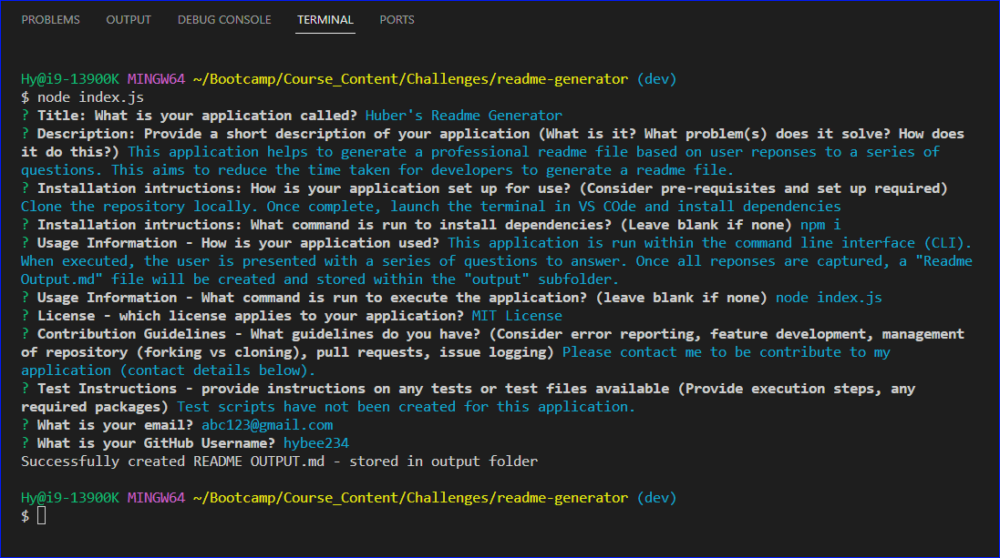
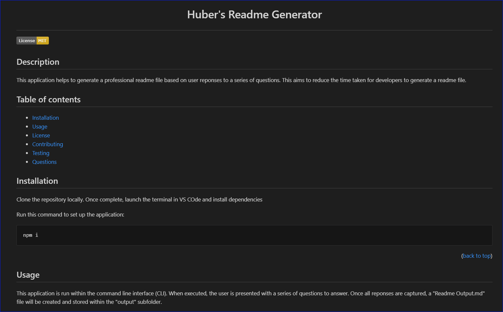

# readme-generator
Challenge 9 - Node.JS

<a name="readme-top"></a>

# <p style="text-align: center;">Huber's Readme Generator</p>

[](https://opensource.org/licenses/MIT)

## Description

This application is a readme file generator that is run within the Command Line Interface (CLI).

The application presents a series of questions for the user to responsd to, the responses are used to generate a professional looking README file.

This application aims to reduce the time and effort required for developers to write a readme file.

This application was created utilising a boiler plate and 

## Table of contents

- <a href="#user-story">User Story<a>
- <a href="#user-acceptance-criteria">User Acceptance Criteria<a>
- [Installation](#installation)
- [Usage](#usage)
- <a href="#video-screenshots">Video and Screenshots<a>
- [License](#license)
- [Contributing](#contributing)
- [Testing](#testing)
- <a href="#technologies-used">Technologies Used<a>
- [Questions](#questions)

## User Story <a ID="user-story"></a>

This application was developed with this user story in mind:

```
AS A developer

I WANT a README generator
SO THAT I can quickly create a professional README for a new project
```

<p align="right">(<a href="#readme-top">back to top</a>)</p>

## User Acceptance Criteria <a ID="user-acceptance-criteria"></a>

This application was developed with the below User acceptance criteria:

```
GIVEN a command-line application that accepts user input

WHEN I am prompted for information about my application repository
THEN a high-quality, professional README.md is generated with the title of my project and sections entitled Description, Table of Contents, Installation, Usage, License, Contributing, Tests, and Questions

WHEN I enter my project title
THEN this is displayed as the title of the README

WHEN I enter a description, installation instructions, usage information, contribution guidelines, and test instructions
THEN this information is added to the sections of the README entitled Description, Installation, Usage, Contributing, and Tests

WHEN I choose a license for my application from a list of options
THEN a badge for that license is added near the top of the README and a notice is added to the section of the README entitled License that explains which license the application is covered under

WHEN I enter my GitHub username
THEN this is added to the section of the README entitled Questions, with a link to my GitHub profile

WHEN I enter my email address
THEN this is added to the section of the README entitled Questions, with instructions on how to reach me with additional questions

WHEN I click on the links in the Table of Contents
THEN I am taken to the corresponding section of the README

```
<p align="right">(<a href="#readme-top">back to top</a>)</p>

## Video and Screenshots <a ID = "#video-screenshots"></a>

Watch this video to learn more about the application

<a href="https://drive.google.com/file/d/1CQPkWc-zCFDpUQK3k08EP4xWxqfxaRvM/view"> Video - "How to: Huber's Readme Generator" </a>

Screenshot 1: Questions in the command line interface:



Screenshot 2: Snippet of a Readme file genearated by the application



<p align="right">(<a href="#readme-top">back to top</a>)</p>

## Installation

This applications has a couple of dependencies:
* Clone or Fork the repository so that you have a version available locally
* Version 8 of <a href="https://www.npmjs.com/package/inquirer">Inquirer </a>


After creating a local copy of the application, run the below command in the CLI to install dependancies (make sure you are in the root folder of the application when you do this)

~~~
npm install 
~~~
            

<p align="right">(<a href="#readme-top">back to top</a>)</p>

## Usage

To execute the application, open then CLI, navigate to the root folder of this application and run command: 
~~~
node index.js
~~~

The readme generator will present a series of questions for you to respond to and, based on your answers, will produce a `README OUTPUT.md` file within the `output` folder

        

<p align="right">(<a href="#readme-top">back to top</a>)</p>
    
## License


[](https://opensource.org/licenses/MIT)

This application can be used in conjunction with licensing covered in  <b>MIT Lcensee</b>

(Click on the badge for details of the license)

<p align="right">(<a href="#readme-top">back to top</a>)</p>

## Contributing

To contibute to this application, please reach out to me via my contact details below

<p align="right">(<a href="#readme-top">back to top</a>)</p>

## Testing

A test script file has not been created, however manual testing can be carried out

### Applications Testing

* Validate that when you run ``` node index.js ``` in CLI that you are presented with a series of questions to answer
* Validate that when the questions have all been answered, that a `README OUTPUT.md` file is generated in the `output` subfolder
* Validate that the links in the Table of contents successfully moves you to the corresponding section of the readme
* Validate that the `back to top` links successfully moves you to the start of the readme file.

* Validate that if the user response to the Installation Command is blank, then the code block within the Installation section does not popualte
* Validate that if the user response to the Usage Command is blank, then the code block within the Usage section does not populate 

* Validate that the License badge populates and that it matches the license selected by the user. 
* Validate that clicking on the License badge opens a new browser that brings you to the  corresponding license page.
* Validate that the text in the License section is populating with the selected license.
* Validate that if the user selects "none" for license, then the license text will indication "This applciation does not have a defined use license"


<p align="right">(<a href="#readme-top">back to top</a>)</p>

## Technologies used <a ID="technologies-used"></a>

* Javascript
* Node.js
* Node Package Manager (NPM)
* Inquirer
* File System Package

<p align="right">(<a href="#readme-top">back to top</a>)</p>


## Questions

- Visit my GitHub page: <a href="https://github.com/hybee234"> hybee234 </a>
  
<p align="right">(<a href="#readme-top">back to top</a>)</p>
